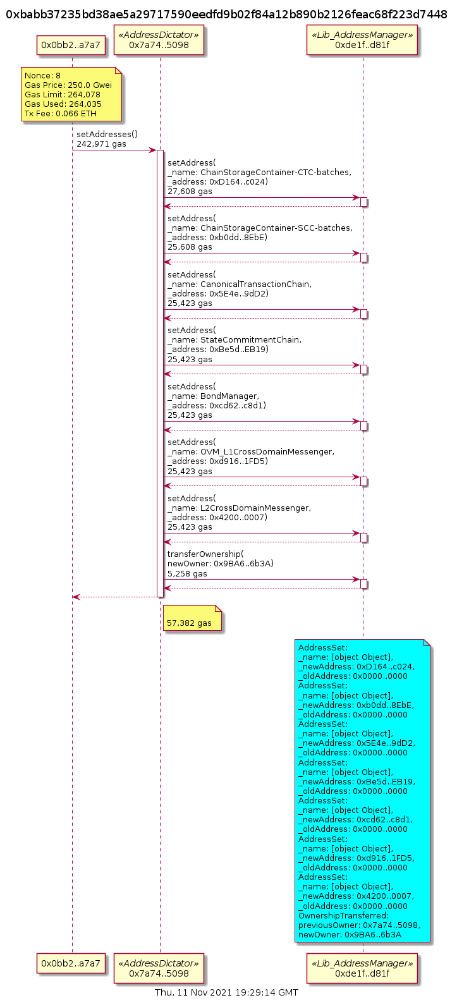

Address Dictator
================


Deployed in Mainnet: 0x7a74f7934a233e10e8757264132b2e4ebccf5098


*The AddressDictator (glory to Arstotzka) is a contract that allows us to safely manipulate      many different addresses in the AddressManager without transferring ownership of the      AddressManager to a hot wallet or hardware wallet.*

## Methods

### finalOwner

```solidity
function finalOwner() external view returns (address)
```


#### Returns

| Name | Type | Description |
|---|---|---|
| _0 | address | undefined

### getNamedAddresses

```solidity
function getNamedAddresses() external view returns (struct AddressDictator.NamedAddress[])
```

Returns the full namedAddresses array.


#### Returns

| Name | Type | Description |
|---|---|---|
| _0 | AddressDictator.NamedAddress[] | undefined

### manager

```solidity
function manager() external view returns (contract Lib_AddressManager)
```


#### Returns

| Name | Type | Description |
|---|---|---|
| _0 | contract Lib_AddressManager | undefined

### returnOwnership

```solidity
function returnOwnership() external nonpayable
```

Transfers ownership of this contract to the finalOwner. Only callable by the Final Owner, which is intended to be our multisig. This function shouldn&#39;t be necessary, but it gives a sense of reassurance that we can recover if something really surprising goes wrong.


### setAddresses

```solidity
function setAddresses() external nonpayable
```

Called to finalize the transfer, this function is callable by anyone, but will only result in an upgrade if this contract is the owner Address Manager.


* Transactions


This contract was deployed by https://etherscan.io/address/0x0bb2ca5ea700ba04c713008e1a3d198b4e8da7a7 and also setup by the same address.
The transaction below was also called by the deployer.
This is the only transaction there.




## Call Graph
![Alt text](https://g.gravizo.com/svg?
  digraph G {
  graph [ ratio = "auto", page = "100", compound =true, bgcolor = "#2e3e56" ];
  node [ style = "filled", fillcolor = "#edad56", color = "#edad56", penwidth =3 ];
  edge [ color = "#fcfcfc", penwidth =2, fontname = "helvetica Neue Ultra Light" ];
subgraph "clusterAddressDictator" {
  graph [ label = "AddressDictator", color = "#445773", fontcolor = "#f0f0f0", style = "rounded", bgcolor = "#445773" ];
  "AddressDictator.<Constructor>" [ label = "<Constructor>", color = "#FF9797", fillcolor = "#FF9797" ];
  "AddressDictator.setAddresses" [ label = "setAddresses", color = "#ffbdb9", fillcolor = "#ffbdb9" ];
  "AddressDictator.returnOwnership" [ label = "returnOwnership", color = "#ffbdb9", fillcolor = "#ffbdb9" ];
  "AddressDictator.getNamedAddresses" [ label = "getNamedAddresses", color = "#ffbdb9", fillcolor = "#ffbdb9" ];
}

subgraph "clusterLib_AddressManager" {
  graph [ label = "Lib_AddressManager", color = "#e8726d", fontcolor = "#f0f0f0", style = "rounded,dashed", bgcolor = "#3b4b63" ];
  "Lib_AddressManager.setAddress" [ label = "setAddress" ];
  "Lib_AddressManager.transferOwnership" [ label = "transferOwnership" ];
}

  "AddressDictator.setAddresses";
  "Lib_AddressManager.setAddress";
  "Lib_AddressManager.transferOwnership";
  "AddressDictator.returnOwnership";
  "AddressDictator.setAddresses" -> "Lib_AddressManager.setAddress" [ color = "white" ];
  "AddressDictator.setAddresses" -> "Lib_AddressManager.transferOwnership" [ color = "white" ];
  "AddressDictator.returnOwnership" -> "Lib_AddressManager.transferOwnership" [ color = "white" ];


rankdir=LR
node [shape=plaintext]
subgraph cluster_01 { 
label = "Legend";
key [label=<<table border="0" cellpadding="2" cellspacing="0" cellborder="0">
  <tr><td align="right" port="i1">Internal Call</td></tr>
  <tr><td align="right" port="i2">External Call</td></tr>
  <tr><td align="right" port="i3">Defined Contract</td></tr>
  <tr><td align="right" port="i4">Undefined Contract</td></tr>
  </table>>]
key2 [label=<<table border="0" cellpadding="2" cellspacing="0" cellborder="0">
  <tr><td port="i1">&nbsp;&nbsp;&nbsp;</td></tr>
  <tr><td port="i2">&nbsp;&nbsp;&nbsp;</td></tr>
  <tr><td port="i3" bgcolor="#445773">&nbsp;&nbsp;&nbsp;</td></tr>
  <tr><td port="i4">
    <table border="1" cellborder="0" cellspacing="0" cellpadding="7" color="#e8726d">
      <tr>
       <td></td>
      </tr>
     </table>
  </td></tr>
  </table>>]
key:i1:e -> key2:i1:w [color="#1bc6a6"]
key:i2:e -> key2:i2:w [color="white"]
}
}
)


## Inheritance


  ```graphviz
digraph G {
  graph [ ratio = "auto", page = "40" ];
  "AddressDictator";
  "Lib_AddressManager";
  "Ownable";
  "Lib_AddressManager" -> "Ownable";
}
```


##  Sūrya's Description Report

 Files Description Table


|  File Name  |  SHA-1 Hash  |
|-------------|--------------|
| /home/henry/fuse/fuse-l1/src/L1/deployment/AddressDictator.sol | 536079e479d8a46c365d2740f0868d253941629f |
| /home/henry/fuse/fuse-l1/src/libraries/resolver/Lib_AddressManager.sol | a800d9912e132d96d03b8fff3760be510f94a424 |


 Contracts Description Table


|  Contract  |         Type        |       Bases      |                  |                 |
|:----------:|:-------------------:|:----------------:|:----------------:|:---------------:|
|     └      |  **Function Name**  |  **Visibility**  |  **Mutability**  |  **Modifiers**  |
||||||
| **AddressDictator** | Implementation |  |||
| └ | <Constructor> | Public ❗️ | 🛑  |NO❗️ |
| └ | setAddresses | External ❗️ | 🛑  |NO❗️ |
| └ | returnOwnership | External ❗️ | 🛑  |NO❗️ |
| └ | getNamedAddresses | External ❗️ |   |NO❗️ |
||||||
| **Lib_AddressManager** | Implementation | Ownable |||
| └ | setAddress | External ❗️ | 🛑  | onlyOwner |
| └ | getAddress | External ❗️ |   |NO❗️ |
| └ | _getNameHash | Internal 🔒 |   | |


 Legend

|  Symbol  |  Meaning  |
|:--------:|-----------|
|    🛑    | Function can modify state |
|    💵    | Function is payable |


