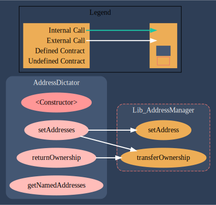
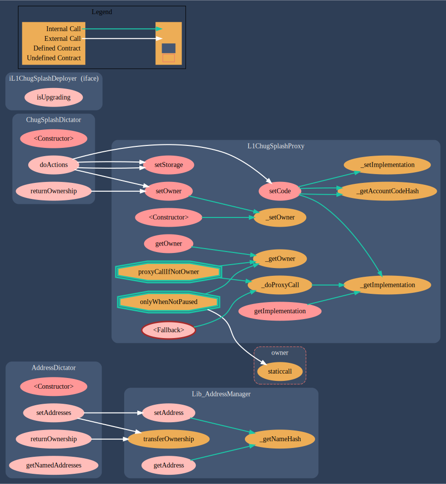
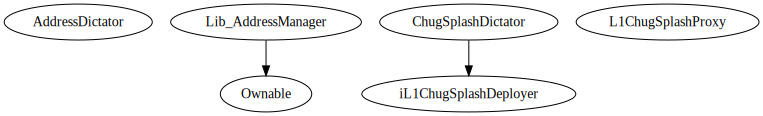

Address Dictator
================


Deployed in Mainnet: 0x7a74f7934a233e10e8757264132b2e4ebccf5098


*The AddressDictator (glory to Arstotzka) is a contract that allows us to safely manipulate      many different addresses in the AddressManager without transferring ownership of the      AddressManager to a hot wallet or hardware wallet.*

## Methods

### finalOwner

```solidity
function finalOwner() external view returns (address)
```


#### Returns

| Name | Type | Description |
|---|---|---|
| _0 | address | undefined

### getNamedAddresses

```solidity
function getNamedAddresses() external view returns (struct AddressDictator.NamedAddress[])
```

Returns the full namedAddresses array.


#### Returns

| Name | Type | Description |
|---|---|---|
| _0 | AddressDictator.NamedAddress[] | undefined

### manager

```solidity
function manager() external view returns (contract Lib_AddressManager)
```


#### Returns

| Name | Type | Description |
|---|---|---|
| _0 | contract Lib_AddressManager | undefined

### returnOwnership

```solidity
function returnOwnership() external nonpayable
```

Transfers ownership of this contract to the finalOwner. Only callable by the Final Owner, which is intended to be our multisig. This function shouldn&#39;t be necessary, but it gives a sense of reassurance that we can recover if something really surprising goes wrong.


### setAddresses

```solidity
function setAddresses() external nonpayable
```

Called to finalize the transfer, this function is callable by anyone, but will only result in an upgrade if this contract is the owner Address Manager.


* Transactions


This contract was deployed by https://etherscan.io/address/0x0bb2ca5ea700ba04c713008e1a3d198b4e8da7a7 and also setup by the same address.
The transaction below was also called by the deployer.
This is the only transaction there.


## Call Graph




## Call Graph Full




## Inheritance





##  Sūrya's Description Report

 Files Description Table


|  File Name  |  SHA-1 Hash  |
|-------------|--------------|
| /home/henry/fuse/fuse-l1/src/L1/deployment/AddressDictator.sol | 536079e479d8a46c365d2740f0868d253941629f |
| /home/henry/fuse/fuse-l1/src/libraries/resolver/Lib_AddressManager.sol | a800d9912e132d96d03b8fff3760be510f94a424 |


 Contracts Description Table


|  Contract  |         Type        |       Bases      |                  |                 |
|:----------:|:-------------------:|:----------------:|:----------------:|:---------------:|
|     └      |  **Function Name**  |  **Visibility**  |  **Mutability**  |  **Modifiers**  |
||||||
| **AddressDictator** | Implementation |  |||
| └ | <Constructor> | Public ❗️ | 🛑  |NO❗️ |
| └ | setAddresses | External ❗️ | 🛑  |NO❗️ |
| └ | returnOwnership | External ❗️ | 🛑  |NO❗️ |
| └ | getNamedAddresses | External ❗️ |   |NO❗️ |
||||||
| **Lib_AddressManager** | Implementation | Ownable |||
| └ | setAddress | External ❗️ | 🛑  | onlyOwner |
| └ | getAddress | External ❗️ |   |NO❗️ |
| └ | _getNameHash | Internal 🔒 |   | |


 Legend

|  Symbol  |  Meaning  |
|:--------:|-----------|
|    🛑    | Function can modify state |
|    💵    | Function is payable |


