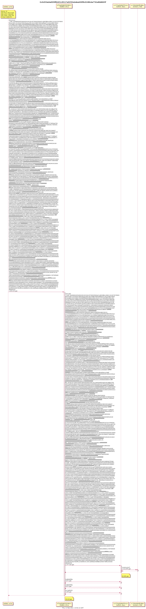

# ChugSplashDictator


> ChugSplashDictator


*Like the AddressDictator, but specifically for the Proxy__OVM_L1StandardBridge. We&#39;re      working on a generalized version of this but this is good enough for the moment.*

## Methods

### bridgeSlotKey

```solidity
function bridgeSlotKey() external view returns (bytes32)
```


#### Returns

| Name | Type | Description |
|---|---|---|
| _0 | bytes32 | undefined

### bridgeSlotVal

```solidity
function bridgeSlotVal() external view returns (bytes32)
```


#### Returns

| Name | Type | Description |
|---|---|---|
| _0 | bytes32 | undefined

### codeHash

```solidity
function codeHash() external view returns (bytes32)
```


#### Returns

| Name | Type | Description |
|---|---|---|
| _0 | bytes32 | undefined

### doActions

```solidity
function doActions(bytes _code) external nonpayable
```


#### Parameters

| Name | Type | Description |
|---|---|---|
| _code | bytes | undefined

### finalOwner

```solidity
function finalOwner() external view returns (address)
```


#### Returns

| Name | Type | Description |
|---|---|---|
| _0 | address | undefined

### isUpgrading

```solidity
function isUpgrading() external view returns (bool)
```


#### Returns

| Name | Type | Description |
|---|---|---|
| _0 | bool | undefined

### messengerSlotKey

```solidity
function messengerSlotKey() external view returns (bytes32)
```


#### Returns

| Name | Type | Description |
|---|---|---|
| _0 | bytes32 | undefined

### messengerSlotVal

```solidity
function messengerSlotVal() external view returns (bytes32)
```


#### Returns

| Name | Type | Description |
|---|---|---|
| _0 | bytes32 | undefined

### returnOwnership

```solidity
function returnOwnership() external nonpayable
```

Transfers ownership of this contract to the finalOwner. Only callable by the finalOwner, which is intended to be our multisig. This function shouldn&#39;t be necessary, but it gives a sense of reassurance that we can recover if something really surprising goes wrong.


### target

```solidity
function target() external view returns (contract L1ChugSplashProxy)
```


#### Returns

| Name | Type | Description |
|---|---|---|
| _0 | contract L1ChugSplashProxy | undefined


This contract was deployed by https://etherscan.io/address/0x0bb2ca5ea700ba04c713008e1a3d198b4e8da7a7 and also setup by the same address.

The transaction below was also called by the deployer.
This is the only transaction there.



